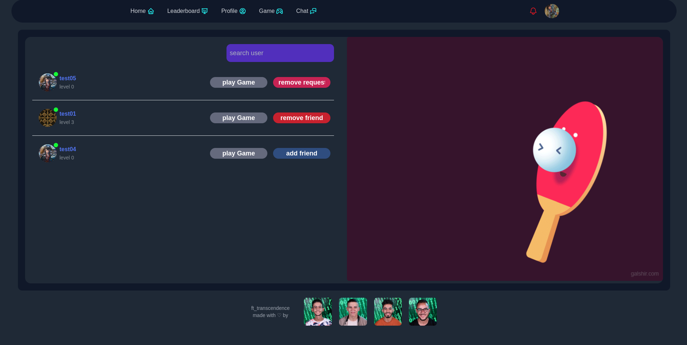
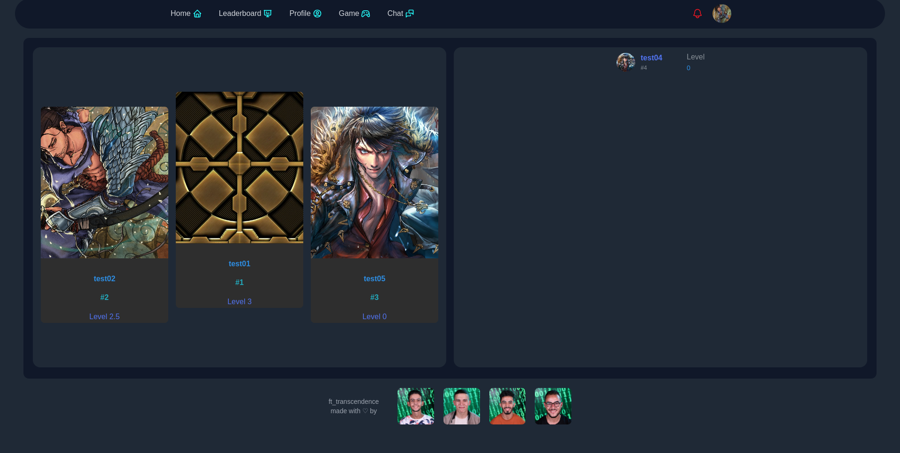
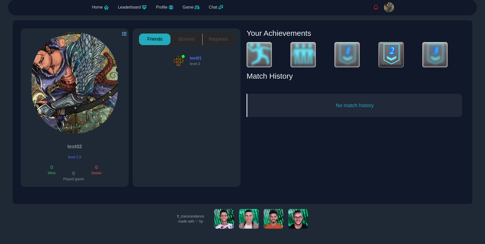
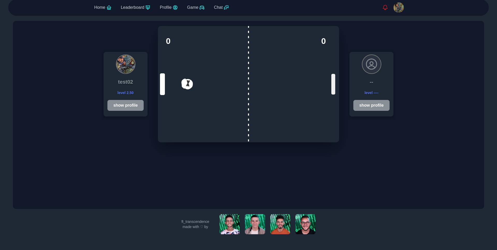
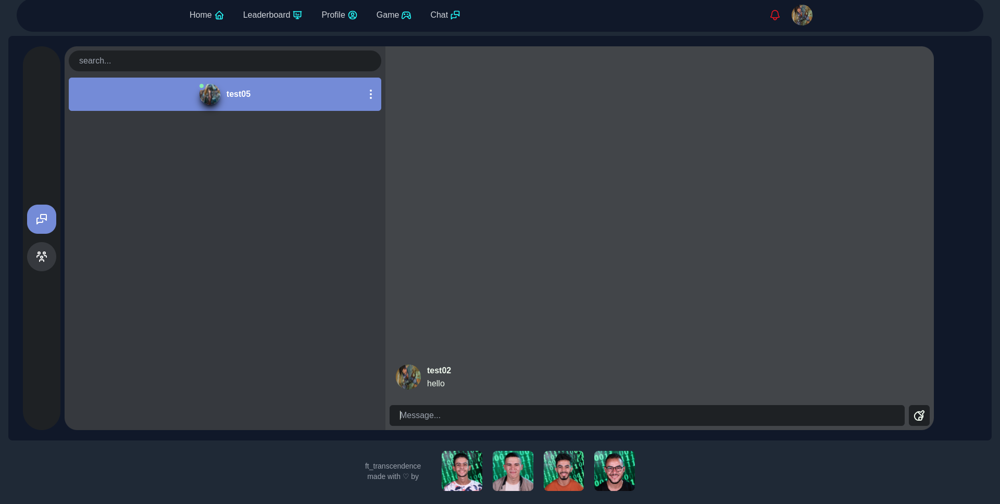

# ft_transcendence

ft_transcendence is a project aimed at creating a multiplayer online pong game platform with a focus on real-time gameplay. The project is the last of the 42 school common core projects.


## Features

- Real-time multiplayer gameplay.
- Player profile management.
- Real-time chat system.
- Game rooms and matchmaking.

## Installation

the project require an .env file in the root directory there is an empty env sample you can use.

1 - build the app with docker-compose
```bash
docker-compose up --build
```
2 - launch the app in your browser
```bash
http://localhost:3001
```


    
## Authors

- [@hfanzaou](https://www.github.com/hfanzaou)
- [@ebensalt](https://www.github.com/EBensalt)
- [@rizqyrahhal](https://www.github.com/rizqyrahhal)
- [@ayoubjn](https://www.github.com/ayoubjn)


## Screenshots







